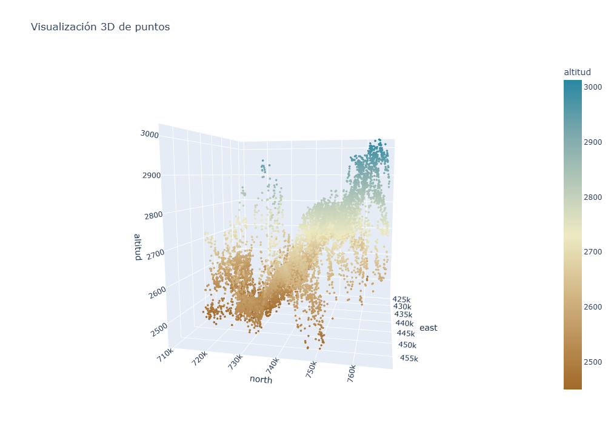

# SantaRosaPlanos

## Introducción 

- **Datos de entrada:** aproximadamente 10.000 puntos de elevación de la región Santa Rosa de Osos (Antioquia, Colombia).  
- **Estructura general:** una superficie inclinada de ~60 km, aunque con variaciones locales significativas en la altura.  
- **Objetivo del proyecto:**  
  - dividir el conjunto de datos en el menor número posible de planos inclinados (idealmente **10–15 planos**),  
  - para poder analizar relaciones topográficas y estimar qué superficies podrían ser más antiguas que otras.  
- **Motivación:**  
  - un único plano global no describe adecuadamente la región,  
  - se requieren estructuras locales más precisas para la interpretación.  
- **Método utilizado:**  
  - aplicación del algoritmo **RANSAC**, que permite identificar planos de manera robusta incluso con ruido y valores atípicos.  
- **Parámetros ajustables:**  
  - **rango de altura** dentro del cual se busca cada plano,  
  - **número mínimo de puntos** necesarios para validar un plano.  
- **Resultado esperado:**  
  - un conjunto segmentado de varios planos coherentes,  
  - útil para análisis geomorfológico y para posteriores procesos en GIS.

  

  

## Algoritmo RANSAC (RANdom SAmple Consensus)

### Descripción general
RANSAC es un algoritmo iterativo diseñado para ajustar un modelo a un conjunto de datos que puede contener una cantidad significativa de valores atípicos (*outliers*).  
A diferencia de los métodos tradicionales de regresión, RANSAC no intenta minimizar el error global, sino encontrar el modelo que **mejor explica la mayoría de los datos válidos** (*inliers*), ignorando aquellos puntos que no se ajustan al patrón dominante.

Este enfoque lo hace especialmente útil en contextos donde los datos provienen de sensores o mediciones con ruido, errores o múltiples estructuras presentes, como en nubes de puntos LiDAR, fotogrametría o modelos digitales de terreno.

---

### Funcionamiento del algoritmo

1. **Selección aleatoria de muestras:**  
   Se eligen de manera aleatoria un número mínimo de puntos necesarios para estimar el modelo (por ejemplo, 3 puntos para definir un plano).

2. **Ajuste del modelo provisional:**  
   A partir de esos puntos se calcula un modelo (por ejemplo, una ecuación de plano `z = a·x + b·y + c`).

3. **Evaluación de todos los puntos:**  
   Se calcula la distancia de cada punto del conjunto al modelo propuesto.  
   Aquellos cuya distancia sea menor que un umbral `t` se consideran **inliers**.

4. **Criterio de consenso:**  
   Si el número de *inliers* es mayor que en las iteraciones anteriores, el modelo se actualiza como el mejor encontrado hasta el momento.

5. **Repetición:**  
   El proceso se repite durante `N` iteraciones o hasta alcanzar una probabilidad de éxito deseada.  
   Finalmente, el modelo con mayor número de *inliers* se refina ajustándolo solo con esos puntos.

6. **(Opcional) Segmentación múltiple:**  
   Una vez encontrada una estructura dominante (por ejemplo, una superficie plana), se eliminan sus *inliers* y se repite el proceso para detectar otras superficies.

---

### Por qué RANSAC es mejor que la regresión lineal en este caso

En un conjunto de datos con puntos de elevación que pertenecen a varias superficies planas (por ejemplo, diferentes techos, terrazas o niveles del terreno), una regresión lineal tradicional intentaría ajustar **una sola superficie** que minimice el error total:

\min_{a,b,c} \sum_i \left(z_i - (a x_i + b y_i + c)\right)^2

El resultado sería una superficie promedio que no representa correctamente ninguna de las estructuras reales: una mezcla entre techos, suelo y otros elementos.  
Además, los puntos alejados (outliers) influyen fuertemente en el resultado, deformando el plano ajustado.

RANSAC, en cambio:

- **Identifica superficies dominantes individualmente**, ajustando una a la vez.  
- **Ignora los outliers**, ya que estos no cumplen el criterio de pertenencia (`distancia < t`).  
- **Permite segmentar la nube de puntos** en varias superficies planas coherentes.  
- **Refleja mejor la estructura física del entorno** (por ejemplo, varios planos reales en un edificio o paisaje).

| Característica | Regresión lineal | RANSAC |
|----------------|------------------|--------|
| Modelo obtenido | Único plano global | Varios planos locales |
| Sensibilidad a outliers | Alta | Baja |
| Tipo de error | Mínimo cuadrático global | Máximo consenso de inliers |
| Representación física | Promedio entre superficies | Planos reales y separados |
| Aplicación ideal | Datos homogéneos | Datos con ruido y múltiples estructuras |

---

### Conclusión

RANSAC es el método más adecuado para segmentar un conjunto de puntos de elevación en múltiples planos, ya que:
- Es **robusto frente a valores atípicos**,
- Detecta **estructuras geométricas reales**, y
- Permite **modelar el entorno de forma más precisa** que una regresión lineal tradicional.

En resumen:

> **La regresión lineal busca explicar todos los puntos a la vez.  
> RANSAC entiende que no todos pertenecen a la misma superficie.**
